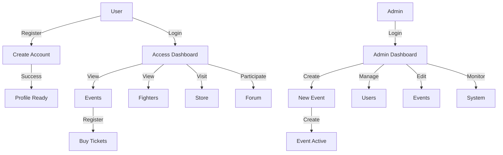
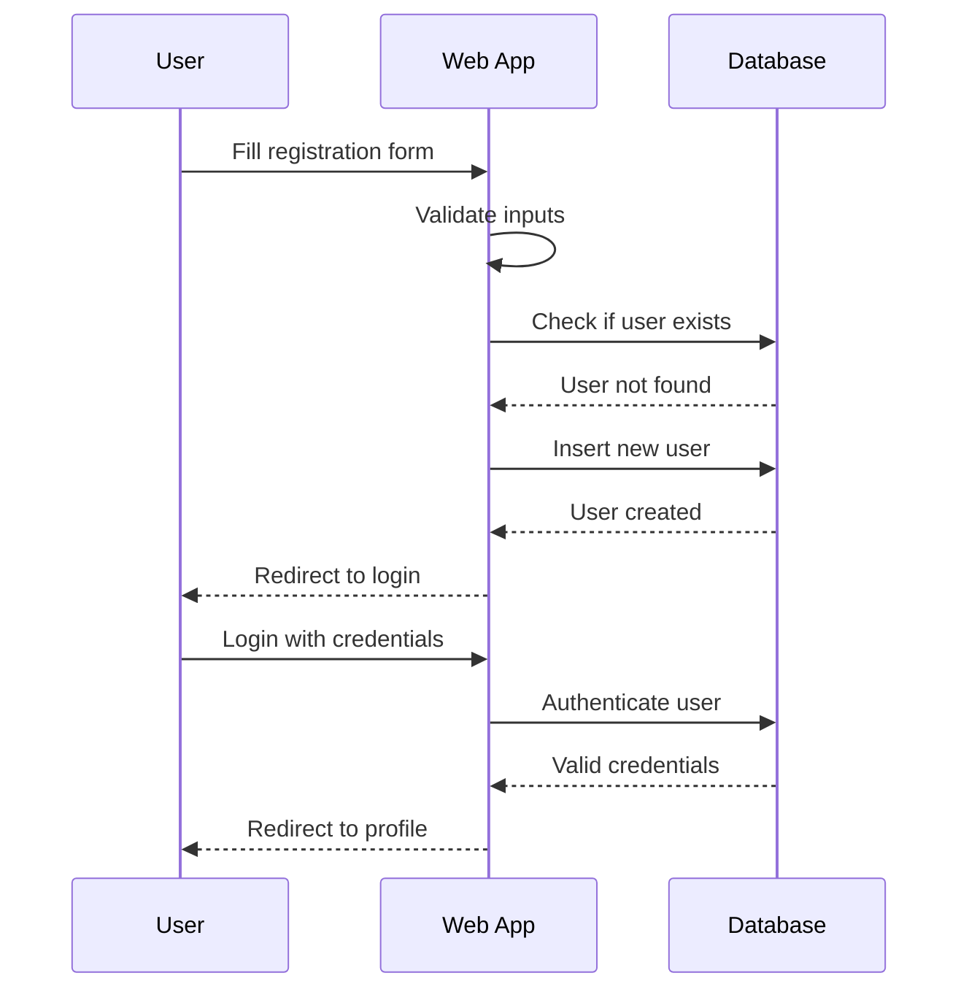
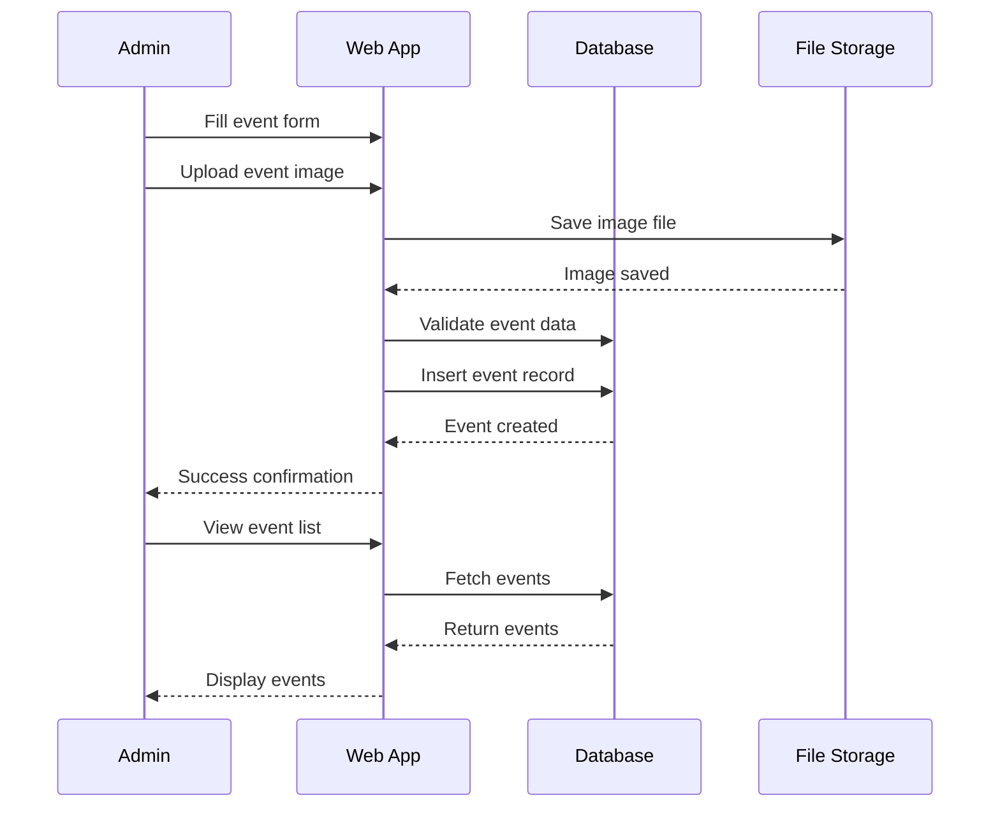
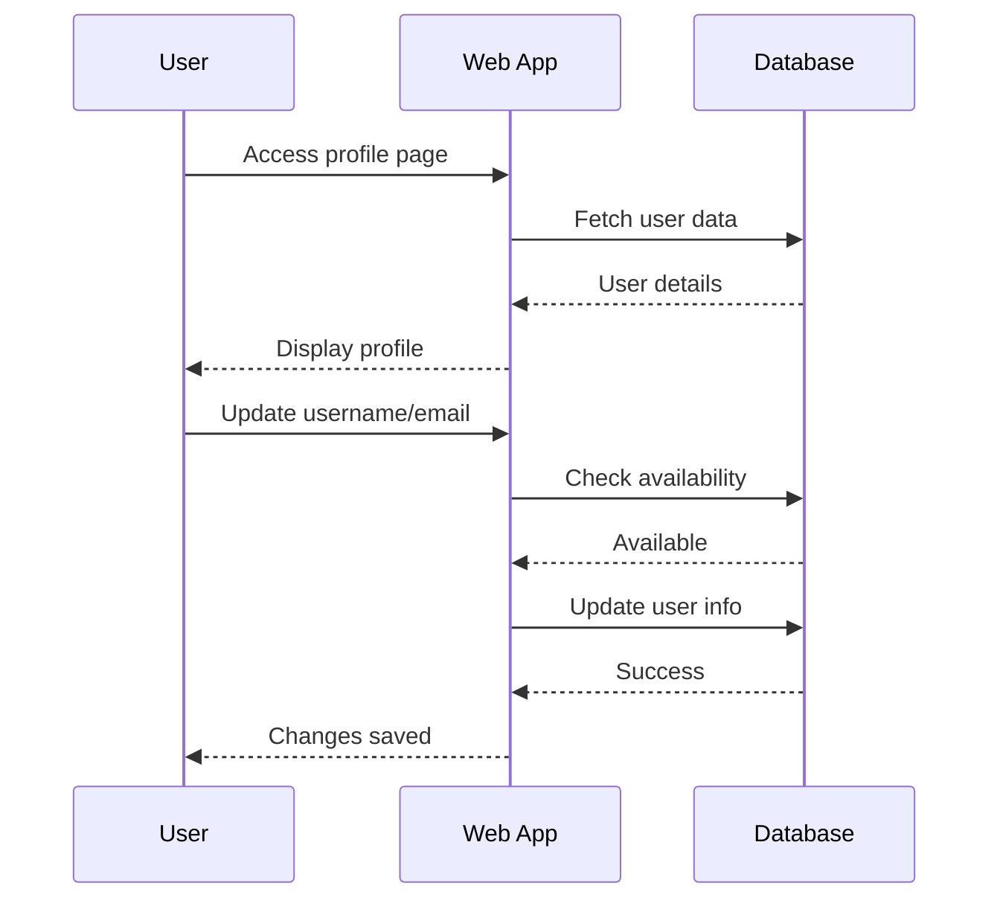

# Knockout Zone - Combat Sports Management Platform

A comprehensive web application for managing combat sports events, fighter profiles, and community engagement.

## Table of Contents

- [Overview](#overview)
- [Main Functionalities](#main-functionalities)
- [Main Use Cases](#main-use-cases)
- [System Architecture](#system-architecture)
- [Application Flow](#application-flow)
- [Database Schema](#database-schema)
- [Installation & Setup](#installation--setup)
- [API Endpoints](#api-endpoints)
- [File Structure](#file-structure)

---

## Overview

Knockout Zone is a platform designed for:
- **Event Management**: Create, update, and manage combat sports events
- **User Management**: Register users, manage profiles, and handle authentication
- **Community Building**: Store, forum, and fighter information showcase
- **Admin Control**: Dedicated admin features for event and user management

---

## Main Functionalities

### 1. **User Management**
- User registration with email validation
- Admin registration with special privileges
- User login/logout with session management
- Profile management (update username, email, password)
- Profile picture upload and management
- Account deletion

### 2. **Event Management**
- Create new events with detailed information
- Upload event images
- Edit event details (title, date, location, description)
- Delete events (owner only)
- View all upcoming events with sorting by date
- Event filtering and search capabilities

### 3. **Content Management**
- Store section with merchandise listings
- Fighters directory with profiles
- Forum for community discussions
- About Us information page
- Home page with featured content

### 4. **Admin Features**
- Admin-only event management
- User management capabilities
- Profile picture management
- Event statistics and tracking

---

## Main Use Cases

### Use Case 1: New User Registration

### Use Case 2: Event Creation & Management

### Use Case 3: User Profile Management

---

